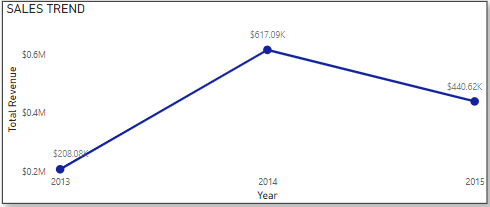

# Northwind-Traders
# Sales and Operational Analysis
## by Winnie Ngaji
  
___
# INTRODUCTION
This project involves an in-depth analysis of the sales and order data from Northwind Traders, a fictional gourmet food supplier specializing in the import and export of unique food products from various countries. The dataset contains information on customers, products, orders, shippers, and employees, giving details on the operational dynamics of Northwind Traders. Through this analysis, I aim to derive valuable insights into the company's business trends and customer interactions, contributing to a better understanding of its market presence and operational performance.
___
# PROJECT OBJECTIVES
I will be using the provided dataset to understand customer spending patterns and make changes to the companies' sales and operational strategies to improve performance. Specifically, I aim to achieve the following goals:

1. Are there any noticeable sales trends over time?
2. Which are the best and worst-selling products?
3. Can you identify any key customers?
4. Are shipping costs consistent across providers?
5. Assess the sales contributions of individual employees
6. Investigate products that have been discontinued but are still being ordered
7. Explore the shipping interval from the order date
___
# SKILLS DEMONSTRATED
For this project, I used the following skills and tools;
  ### EXCEL: I leveraged Excel for data cleaning; removing duplicate values, correcting formatting issues, handling missing data through imputation or deletion, and standardizing data formats for consistency, and transformation to ensure data quality.
  
  ### SQL: After cleaning and transforming my data on Excel, I created tables and imported the dataset into Postgresql for further analysis. I Utilized SQL queries to extract relevant information from the Northwind Traders database for in-depth analysis. I also integrated data from multiple tables using SQL join operations to establish meaningful relationships between different datasets.
    
  
  ### Power BI: After loading the dataset into Power BI, I used measures and DAX to aggregate the necessary data I needed. I also created an interactive dashboard to answer the business questions stated in the project objective section
___
# DATA TRANSFORMATION
After importing the data to Power BI, I did some transformations to add a date table for efficient time analysis. 
   

___
# DATA MODELLING
I have 8 tables and loading the dataset into Power BI creates an automatic model, but I will be making adjustments to the auto model created by Power BI by changing the 'cross-filter direction' to 'Both' to allow more dynamic filtering. This model can be seen in the schema below
   

___

# ANALYSIS AND VISUALIZATION
This report contains 2 pages/ dashboard
## SALES DASHBOARD
  This gives an overview and general information on sales like Total orders, Average order value, total customers, sales trends, best-selling products, top spending customers, etc.
   

## OPERATIONAL ANALYSIS DASHBOARD
This gives an overview and general information on Operations like Average shipping time, Number of orders handled by the top 5 employees, the impact of discontinued products, etc.
  

## LINK TO DASHBOARD ::: [Northwind Traders Dashboard](https://github.com/Winnie-Ngaji/Northwind-Traders/blob/580a122da57c0a3db695baba9b1d2d87705ffa96/Winnie's_NorthWind_Traders_Sales_Dashboard.pbix)   

## BUSINESS QUESTIONS AND INSIGHTS
### Are there any noticeable sales trends over the years?
   
  * We can see a steady increase from 2013 to 2014 which is the best year with over $600K in sales, but since then, sales started declining.
### 2013 Sales Trend
   

### 2014 Sales Trend
   

### 2015 Sales Trend

### Which are the best and worst-selling products?
   

   

### Can you identify any key customers?
   

### Are shipping costs consistent across providers?
   

### Assess the sales contributions of individual employees
   

### Investigate products that have been discontinued but are still being ordered
    

### Explore the shipping interval from the order date
    

___
# RECOMMENDATION AND CONCLUSION
